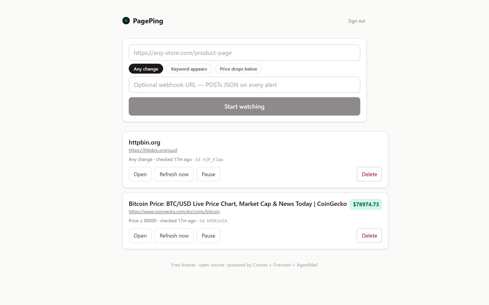
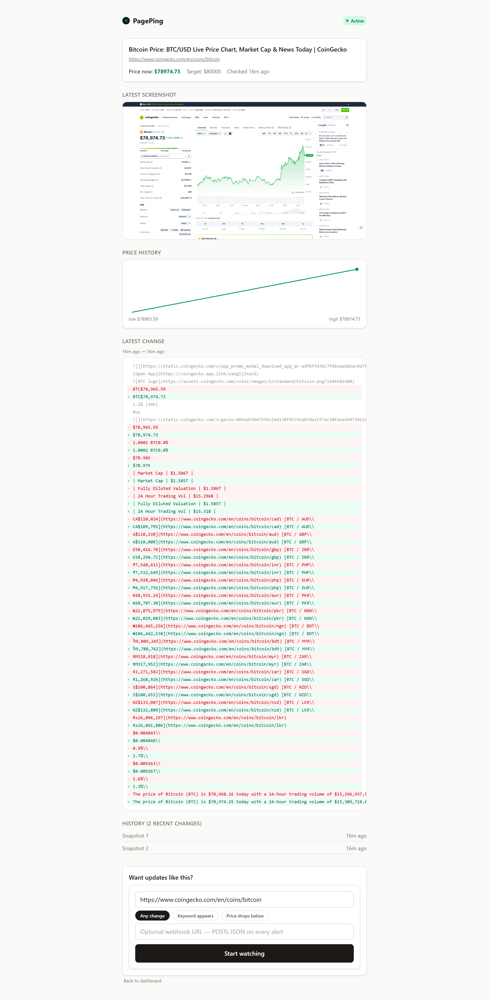

# PagePing

Watch any web page and get an email the moment it changes — hosted, free, and open source. **Live: https://abundant-sardine-977.convex.site**



## Why

Existing page-watch tools make you choose between money and work: [Visualping](https://visualping.io) and [Distill](https://distill.io) paywall your monitoring budget, and [changedetection.io](https://changedetection.io) wants you to run your own server. PagePing gives you the third option — a hosted service that is both free to use and fully open source, built entirely on Convex.

## Features

- **3 watch triggers** — *Any change* on the page, *keyword appears* in content, or *price drops below* a threshold (prices parsed with `$ € £ ¥ ₹` support)
- **Track by email** — login with just an email OTP (no passwords); every alert lands in your inbox
- **Public diff pages** — every watch gets a shareable `/w/<id>` link showing the live check history
- **Realtime UI** — snapshots stream into the dashboard as they happen, powered by Convex reactive queries
- **Price sparkline** — watch pages chart the price history of every check
- **Visual snapshots** — each change is captured with a full-page screenshot stored in Convex file storage



- **Pause / resume** any watch from the dashboard without losing its history
- **Webhooks** — optional webhook URL per watch; every alert POSTs a JSON payload
- **AI change summaries** *(optional)* — set `OPENAI_API_KEY` and each diff gets a plain-English "what changed" summary on the watch page

A cron checks watches hourly against their conditions; claimable instant rechecks let you force a check from the share page or UI.

## Tech stack

Built on **[Convex](https://convex.dev)** — database, queries/mutations/actions, crons, scheduled functions, indexes, and realtime sync in one backend. Pages are fetched by **[Firecrawl](https://firecrawl.dev)** (`@firecrawl/firecrawl` component) and emails are sent through **[AgentMail](https://agentmail.to)**'s REST API. The frontend ships as a React SPA served directly from the Convex deployment via `@convex-dev/static-hosting`.

Auth is custom email-OTP (code hashed with Web Crypto, session tokens, 30-day sessions).

## Self-host

```bash
npm install
```

Create free accounts at:

1. **[convex.dev](https://convex.dev)** — hosting
2. **[firecrawl.dev](https://firecrawl.dev)** — page fetching
3. **[agentmail.to](https://agentmail.to)** — transactional email

Set your secrets on the deployment (values never committed):

```bash
npx convex env set AGENTMAIL_API_KEY <your key>
npx convex env set FIRECRAWL_API_KEY <your key>
# optional:
npx convex env set OPENAI_API_KEY <your key>   # enables AI change summaries
npx convex env set AUTH_DEBUG true   # returns debugCode from requestOtp instead of emailing
```

Then run the dev loop (creates your deployment and writes `.env.local` with `VITE_CONVEX_URL` / `VITE_CONVEX_SITE_URL` automatically):

```bash
npx convex dev      # backend + generated frontend env vars
npm run build       # tsc --noEmit && vite build
npx @convex-dev/static-hosting deploy   # deploy backend + serve dist/ from the same URL as the API
```

Crons (hourly checker) are defined in `convex/crons.ts` and install themselves with the deployment.

## License

MIT — see [LICENSE](LICENSE).
